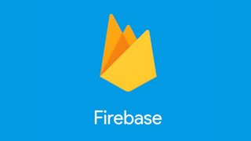

# :clapper: Livecoding en Twitch!

## Emisiones pasadas

### Issue 1: Survapp, sobrevive al fin del mundo con Node.js

**Detalles**
- Expectativas: Versión extendida y en detalle de mi taller "Desarrolla tu Survival Alert con Node.js" del T3chfest de este año. Y además estreno canal!
- Tipo: Walkthrough y Live Coding  
- Nivel: Medio-Avanzado de JavaScript/Nodejs
- Temas: Firebase, Ajax, Eventos, Manipulación del DOM
- Duración: 02:23:10

**Contenido**
- Repasaremos las bases de javaScript y además revisaremos todos los PRs de MovieFire (App de Homenaje)
- Modularización en Nodejs
- Trabajando con Node y NVM para las versiones
- Tabajando con fuentes abiertas de datos
- Vorpal para hacer un CLI
- GOT para hacer llamadas HTTP
- Puppetter como scraper

**Más información**
- [:book: Hilo resumen del capitulo en Twitter](https://twitter.com/kom_256/status/1107205230691794944)
- [:school_satchel:Repo de trabajo](https://github.com/Fictizia/taller-survapp-t3chfest-2019)
- [:tv: Ver en Youtube](https://www.youtube.com/watch?v=vKcCV5_9rKQ)

### Issue 2: Desarrollando una app desde cero con Firebase

**Detalles**
- Tipo: #LiveCoding del bueno!.
- Expectativas: Desarrollaremos una Aplicación web que nos permite guardar nuestras películas favoritas en Firebase.
- Nivel: Medio-Básico de JavaScript
- Temas: Firebase, Ajax, Eventos, Manipulación del DOM
- Duración: 03:22:51

**Contenido**
- Github (Gestión de issues, PRs y demás...)
- GitFlow (Mecánicas de trabajo en ramas)
- Firebase Realtime Database
- Eventos (Click, teclado)
- Ajax (Peticiones Get)
- Brutalismo en CSS (Crudeza visual, etiqueta marquee, etc...)

**Más Información**
- [:book: Hilo resumen del capitulo en Twitter](https://twitter.com/kom_256/status/1109726834227376128)
- [:school_satchel: Repo de trabajo](https://github.com/estreamercoders/Homenaje-a-movieFire)
- [:tv: Ver en Youtube](https://www.youtube.com/watch?v=A7FfQvh7IUc)

### Issue 3: Desarrollando una app desde cero con Firebase

**Detalles**
- Tipo: Walkthrough y Live Coding
- Expectativas: Repasaremos las bases de javaScript y además revisaremos todos los PRs de MovieFire (App de Homenaje)
- Nivel: Medio-Básico de JavaScript
- Temas: Firebase, Ajax, Eventos, Manipulación del DOM
- Duración: 03:19:26

**Contenido**
- [JavaScript, ¡Inspírate!](https://leanpub.com/javascript-inspirate)
- Tipos de datos en JavaScript
- Validaciones de datos
- Trabajo con cadenas, numeros y boleanos
- Trabajo con Punteros (deep copy vs shadow copy)
- Estrcuturas condicionales (`if`, `else`, `else if`, operador ternario)
- `==` vs. `===`
- Programación funcional con Arrays (`reduce`, `sort`, `map`)
- Trazas de ES6 (arrow functions)
- Filtrado de arrays y arrays de objetos
- Manpulación del DOM (inserciones dinamicas de datos filtrados)
- Usando promesas para gestionar AJAX
- Usando `Promise.all` para hacer +30 llamadas Ajax en paralelo
- Buenas practicas

**Más Información**
- [:book: Hilo resumen del capitulo en Twitter](https://twitter.com/kom_256/status/1112623559539638273)
- [:school_satchel: Repo de trabajo](apuntes/issue3)
- [:tv: Ver en Youtube](https://www.youtube.com/watch?v=p59kAq_TB7w)

## :coffee: Apoyame!
**🍻 Si te gusta lo que hago y quieres apoyarme siempre puedes invitarme a un Café virtual ☕️ para reponer cafeína 😋**

